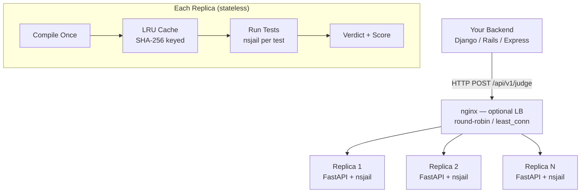

<p align="center">
  <h1 align="center">CP Compiler</h1>
  <p align="center">
    Production-grade competitive programming judge with nsjail sandboxing
    <br />
    <a href="#quick-start">Quick Start</a> &middot; <a href="#api-reference">API Reference</a> &middot; <a href="#architecture">Architecture</a>
  </p>
</p>

<p align="center">
  <a href="https://github.com/HackNow-uz/hacknow-cp-compiler/blob/main/LICENSE"></a>
  
  
  
</p>

---

A fast, secure, and horizontally scalable code execution service built for competitive programming platforms. Powers [HackNow](https://hacknow.uz) — Uzbekistan's competitive programming and cybersecurity platform.

## Features

- **19 Languages** — C, C++ (11/14/17/20/23), Python 3, PyPy 3, Java 17, Kotlin, Go, Rust, C#, Pascal, Haskell, Ruby, JavaScript
- **Nsjail Sandbox** — Linux namespace isolation with per-test CPU time and memory measurement
- **IOI / ICPC / Codeforces Scoring** — subtasks with dependencies, custom checkers (Polygon/testlib), fail-fast and partial scoring
- **Compilation Cache** — LRU cache with SHA-256 keying eliminates redundant compilation during rejudges and contests
- **Horizontal Scaling** — stateless replicas behind nginx with automatic backpressure (503 → retry on next replica)
- **Prometheus Metrics** — verdicts, compile time, test time, inflight gauge, score distribution
- **Structured Logging** — JSON logs with submission_id correlation for production debugging

## Quick Start

```bash
git clone https://github.com/HackNow-uz/hacknow-cp-compiler.git
cd hacknow-cp-compiler

cp .env.example .env
# Edit .env — set INTERNAL_TOKEN to a secure random string:
#   python3 -c "import secrets; print(secrets.token_urlsafe(48))"

docker compose up --build -d
```

The service is now running at `http://localhost:8000`.

- **API Docs**: http://localhost:8000/docs
- **Health Check**: http://localhost:8000/api/v1/health
- **Languages**: http://localhost:8000/api/v1/languages

### Test It

```bash
curl -X POST http://localhost:8000/api/v1/run \
  -H "Authorization: Bearer YOUR_TOKEN" \
  -H "Content-Type: application/json" \
  -d '{
    "language_id": "cpp",
    "source_code": "#include<bits/stdc++.h>\nusing namespace std;\nint main(){int a,b;cin>>a>>b;cout<<a+b;}",
    "input": "2 3",
    "time_limit_ms": 1000,
    "memory_limit_mb": 256
  }'
```

## API Reference

### `POST /api/v1/run` — Single Execution

Execute code with one input. Useful for IDE preview and debugging.

| Field | Type | Default | Description |
|-------|------|---------|-------------|
| `language_id` | string | required | Language identifier |
| `source_code` | string | required | Source code (max 100KB) |
| `input` | string | `""` | Stdin input (max 10MB) |
| `time_limit_ms` | int | `1000` | Time limit (100-30000) |
| `memory_limit_mb` | int | `256` | Memory limit (16-1024) |

### `POST /api/v1/judge` — Multi-Test Judging

Judge a submission against multiple test cases with scoring.

| Field | Type | Default | Description |
|-------|------|---------|-------------|
| `submission_id` | string | required | Unique submission ID |
| `problem_id` | string | required | Problem ID |
| `language_id` | string | required | Language identifier |
| `source_code` | string | required | Source code |
| `tests` | TestCase[] | required | Test cases (max 100) |
| `time_limit_ms` | int | `1000` | Default time limit per test |
| `memory_limit_mb` | int | `256` | Default memory limit per test |
| `checker` | CheckerConfig | `null` | Custom checker (standard/tokens/float/custom) |
| `stop_on_first_failure` | bool | `true` | ICPC fail-fast mode |
| `subtasks` | Subtask[] | `null` | IOI-style subtask groups |

### Verdicts

| Code | Meaning |
|------|---------|
| `OK` | Accepted |
| `WA` | Wrong Answer |
| `PE` | Presentation Error (tokens match, format differs) |
| `TLE` | Time Limit Exceeded |
| `MLE` | Memory Limit Exceeded |
| `RTE` | Runtime Error |
| `CE` | Compilation Error |
| `OLE` | Output Limit Exceeded |
| `SE` | Security Violation (blocked source pattern) |
| `IE` | Internal Error |
| `SK` | Skipped (subtask dependency failed) |

### Custom Checkers

Supports Polygon/testlib-style custom checkers. The checker receives input via stdin in a 3-section protocol:

```
{input_byte_len}\n{input_bytes}\n
{expected_byte_len}\n{expected_bytes}\n
{actual_byte_len}\n{actual_bytes}\n
```

Exit codes: `0` = OK, `1` = WA, `2` = PE.

## Architecture



Each replica is fully stateless:
- **Compile once** → binary reused for all tests
- **Compilation cache** → LRU per-replica, SHA-256 keyed
- **Test isolation** → each test runs in its own nsjail namespace
- **Concurrency control** → global + per-language semaphores prevent CPU thrashing
- **Backpressure** → 503 when overloaded, nginx retries next replica

### Sandbox Security

- **Linux Namespaces**: mount, pid, user, net, ipc
- **Unprivileged execution**: uid 1000 inside sandbox
- **Read-only filesystem**: only `/tmp` is writable
- **No network access**: network namespace isolated
- **Source validation**: blocks `//go:embed`, absolute `#include`, `include_bytes!`
- **Compiler hardening**: `-ffile-prefix-map` hides host paths

## Supported Languages

| Language | ID | Compiler | Time Multiplier | Memory Multiplier |
|----------|-----|---------|-----------------|-------------------|
| C | `c` | GCC 13 (C17) | 1x | 1x |
| C++11 | `cpp11` | G++ 13 | 1x | 1x |
| C++14 | `cpp14` | G++ 13 | 1x | 1x |
| C++17 | `cpp` | G++ 13 | 1x | 1x |
| C++20 | `cpp20` | G++ 13 | 1x | 1x |
| C++23 | `cpp23` | G++ 13 | 1x | 1x |
| Python 3 | `py` | CPython 3.11 | 3x | 2x |
| PyPy 3 | `pypy3` | PyPy 3.10 | 2x | 2x |
| Java | `java` | OpenJDK 17 | 2x | 2x |
| Kotlin | `kotlin` | Kotlin 1.9 | 2x | 2x |
| Go | `go` | Go 1.19 | 1x | 1x |
| Rust | `rust` | Rust 1.75 | 1x | 1x |
| C# | `csharp` | Mono | 2x | 2x |
| Pascal | `pascal` | FreePascal 3.2 | 1x | 1x |
| Haskell | `haskell` | GHC 9.0.2 | 1x | 1x |
| JavaScript | `js` | Node.js 20 | 2x | 2x |
| Ruby | `ruby` | Ruby 3.1 | 3x | 2x |

## Configuration

All settings are configurable via environment variables:

| Variable | Default | Description |
|----------|---------|-------------|
| `INTERNAL_TOKEN` | required | Bearer token for API auth |
| `LOG_LEVEL` | `INFO` | Logging level |
| `LOG_FORMAT` | `json` | `json` or `text` |
| `COMPILE_CACHE_MAX_ENTRIES` | `256` | LRU cache size (0 = disabled) |
| `COMPILE_CACHE_TTL_SECONDS` | `600` | Cache entry TTL |
| `MAX_INFLIGHT_JUDGE_REQUESTS` | `0` (auto) | Backpressure limit |
| `OUTPUT_LIMIT_MB` | `16` | Max stdout size |
| `UVICORN_WORKERS` | `4` | HTTP workers per replica |

## Scaling for Contests

For high-load scenarios (200+ concurrent users):

```bash
# Scale to 3 replicas
docker compose up -d --scale cp-compiler=3

# Or set in .env
COMPILER_REPLICAS=3
```

Add an nginx load balancer in front with `least_conn` and `proxy_next_upstream error timeout http_503`.

## Monitoring

Prometheus metrics are available at `GET /api/v1/metrics`:

- `cp_judge_verdicts_total{language, verdict}` — verdict distribution
- `cp_judge_compile_time_ms{language}` — compilation latency
- `cp_judge_test_time_ms{language}` — per-test execution latency
- `cp_judge_duration_seconds{language}` — end-to-end judge duration
- `cp_judge_inflight{language}` — currently processing

Health endpoint (`GET /api/v1/health`) returns compile cache stats, concurrency info, and temp directory usage.

## License

[MIT](LICENSE) — built by [HackNow](https://hacknow.uz)
